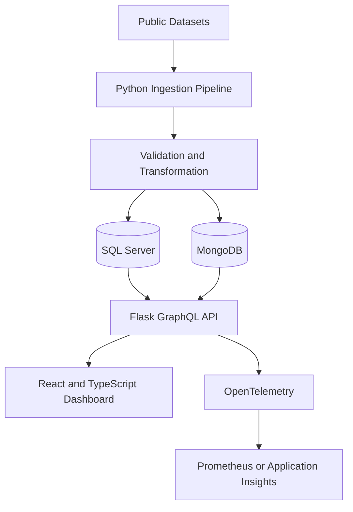

# World Happiness Report Analytics Platform

A full-stack global wellbeing analytics platform designed to ingest, transform, and analyze multi-year World Happiness data through a typed GraphQL API and interactive visualizations.

The platform combines structured country-level indicators from SQL Server with dataset metadata and contextual documents from MongoDB. It enables users to explore global rankings, compare countries, analyze historical trends, and examine descriptive relationships between wellbeing indicators.

> **Current status:** The architecture, data model, and implementation are being finalized. This README describes the confirmed public scope of the project. Source code, verified setup instructions, application screenshots, tests, and analytical results will be published after they are reproducible from this repository.

---

## Overview

The World Happiness Report project is being developed as a full-stack data platform rather than a single notebook or static visualization.

The completed platform will provide a reproducible pipeline for ingesting multi-year public datasets, validating and transforming country-level indicators, storing normalized analytical records, exposing them through GraphQL, and presenting the results through an accessible React dashboard.

The project focuses on data engineering, backend development, GraphQL aggregation, database design, interactive analytics, observability, testing, and responsible interpretation of public datasets.

---

## Problem Statement

World Happiness datasets contain valuable information about global wellbeing, but meaningful analysis requires more than ranking countries for a single year.

A useful analytics platform must be able to:

* Combine datasets from multiple reporting years
* Handle changing column names and schemas
* Normalize country and regional information
* Preserve dataset sources and metadata
* Support efficient ranking and comparison queries
* Join structured indicators with contextual information
* Explain missing or incomplete records
* Clearly separate correlation from causation
* Provide accessible and interactive visualizations
* Ensure analytical results are reproducible

This project addresses those requirements through a modular data platform.

---

## Planned Release Scope

### Multi-Year Data Processing

* Reproducible ingestion of public World Happiness datasets
* Support for multiple reporting years
* Dataset schema validation
* Country and region normalization
* Missing-value detection and reporting
* Duplicate-record validation
* Versioned transformation pipeline
* Source and license attribution
* Repeatable database loading
* Data-quality summaries

### Global Rankings

* Country rankings by year
* Regional ranking analysis
* Highest- and lowest-ranking countries
* Ranking changes across years
* Indicator-based sorting
* Pagination and filtering
* Country and region search

### Country Comparisons

* Side-by-side country comparisons
* Historical happiness-score trends
* Changes in individual indicators
* Regional and global benchmark comparisons
* Multi-country trend visualization
* Year-over-year ranking movement

### Indicator Analysis

The platform will support descriptive analysis of indicators such as:

* Happiness or life-evaluation score
* GDP per capita
* Social support
* Healthy life expectancy
* Freedom to make life choices
* Generosity
* Perceptions of corruption
* Regional classification

Indicator availability may vary between report years. The ingestion pipeline will record schema differences rather than silently inventing missing values.

### Interactive Visualizations

* Global ranking charts
* Regional distribution views
* Country comparison charts
* Multi-year trend lines
* Indicator correlation views
* Ranking-change visualizations
* Filterable data tables
* Responsive dashboard layouts
* Accessible chart descriptions

### GraphQL API

* Typed country and indicator queries
* Ranking queries by year
* Country comparison queries
* Historical trend queries
* Regional aggregation
* Dataset metadata queries
* Pagination, filtering and sorting
* Query input validation
* Structured GraphQL errors
* Query-performance monitoring

---

## Architecture

---

## Component Responsibilities

| Component            | Responsibility                                               |
| -------------------- | ------------------------------------------------------------ |
| Data ingestion       | Downloads, versions and validates public datasets            |
| Transformation layer | Normalizes countries, years, regions and indicators          |
| SQL Server           | Stores normalized country, year and indicator records        |
| MongoDB              | Stores dataset metadata, country notes and source documents  |
| Flask backend        | Provides application services and GraphQL integration        |
| GraphQL layer        | Aggregates SQL Server and MongoDB data through typed queries |
| React dashboard      | Presents rankings, comparisons, correlations and trends      |
| Plotly               | Produces interactive analytical visualizations               |
| OpenTelemetry        | Captures request traces, query timing and processing metrics |
| Docker Compose       | Runs the complete platform locally                           |

---

## Data Storage Strategy

### SQL Server

SQL Server will store structured analytical records, including:

* Countries
* Regions
* Reporting years
* Country-year observations
* Happiness rankings
* Happiness scores
* Normalized indicator values
* Data-quality flags
* Ingestion versions

The database design will include documented primary keys, foreign keys, uniqueness constraints and indexes for commonly filtered fields.

### MongoDB

MongoDB will store flexible and document-oriented information, including:

* Dataset metadata
* Source URLs
* Dataset license information
* Schema versions
* Country notes
* Indicator definitions
* Ingestion summaries
* Source-document references
* Transformation warnings

### GraphQL Aggregation

The GraphQL layer will combine analytical records from SQL Server with descriptive metadata from MongoDB. This separation demonstrates how relational and document databases can support different responsibilities within one application.

---

## Technology Stack

### Data Engineering

* Python
* pandas
* NumPy
* Schema validation
* Reproducible ETL pipelines
* Multi-year public datasets

### Backend

* Flask
* GraphQL
* Typed query schemas
* Input validation
* Pagination and filtering
* Structured error handling

### Databases

* Microsoft SQL Server
* MongoDB
* Documented SQL indexes
* Versioned ingestion records

### Frontend and Visualization

* React
* TypeScript
* Plotly
* Responsive CSS
* Accessible chart components

### Infrastructure and Operations

* Docker
* Docker Compose
* GitHub Actions
* OpenTelemetry
* Prometheus
* Azure Application Insights
* Structured logging

### Testing

* PyTest
* GraphQL API tests
* Data-validation tests
* Database integration tests
* Frontend component tests
* End-to-end smoke tests

---

## Example Analytical Workflow

1. A versioned ingestion job obtains a documented public dataset.
2. The pipeline validates required columns and data types.
3. Country, region, year and indicator values are normalized.
4. Invalid, duplicate or incomplete records are reported.
5. Structured country-year observations are loaded into SQL Server.
6. Dataset metadata and transformation summaries are stored in MongoDB.
7. The GraphQL API retrieves analytical and contextual information.
8. The React dashboard renders rankings, comparisons and trends.
9. OpenTelemetry records ingestion and query performance.
10. Results remain traceable to their original dataset and transformation version.

---

## Analytical Responsibility

This platform is intended for educational and exploratory data analysis.

The project will follow these principles:

* Correlation will not be described as causation.
* Country rankings will not be treated as complete measures of individual wellbeing.
* Missing data and schema changes will be disclosed.
* Dataset methodology and limitations will be documented.
* Results will remain traceable to public sources.
* Transformations will be reproducible.
* Unsupported social, political or economic conclusions will not be presented.
* Charts will include labels, units and contextual explanations.

---

## Testing Strategy

The completed release will include:

* Dataset schema-validation tests
* Country-normalization tests
* Missing-value and duplicate-record tests
* Transformation regression tests
* SQL Server repository tests
* MongoDB repository tests
* GraphQL resolver and query tests
* Pagination and filtering tests
* Invalid-query and failure-path tests
* Frontend component tests
* Chart data-contract tests
* End-to-end dashboard smoke tests
* Docker service health checks

Analytical results will be published only after the data pipeline and evaluation commands can be reproduced from a clean environment.

---

## Observability

The platform is intended to monitor:

* Dataset ingestion duration
* Records processed, accepted and rejected
* Validation failure counts
* GraphQL request duration
* Resolver performance
* SQL Server query latency
* MongoDB query latency
* API error rates
* Dashboard request failures
* Service health and availability

OpenTelemetry will provide traces and metrics that can be exported to Prometheus, Grafana or Azure Application Insights.

---

## Local Development

The completed project will run through Docker Compose with:

* Flask and GraphQL backend
* SQL Server Developer Edition
* MongoDB
* React frontend
* Local observability services
* Seed or sample datasets
* Health checks

The public release will include:

* Deterministic dependency lockfiles
* `.env.example`
* Database initialization
* Reproducible ingestion commands
* Development seed data
* Backend and frontend startup commands
* Test commands
* Production build instructions

Exact commands will be added after they are verified from a clean clone.

---

## Release Requirements

The first public implementation release will be considered complete when:

* Multi-year datasets can be obtained reproducibly
* Every dataset has source and license attribution
* Country and indicator data are normalized consistently
* SQL Server stores structured analytical records
* MongoDB stores metadata and contextual documents
* GraphQL combines data from both databases
* Ranking, comparison, correlation and trend views function
* Pagination, filtering and validation are tested
* Docker Compose starts the complete local platform
* Backend, frontend and data-pipeline tests pass
* Charts are generated from the working application
* Analytical limitations are documented
* The repository contains no secrets or unsupported claims

---

## Project Goals

This project is intended to demonstrate practical experience with:

* Python data engineering
* Flask backend development
* GraphQL API design
* SQL and document database integration
* Data modeling and indexing
* Multi-source data aggregation
* React and TypeScript development
* Interactive data visualization
* Reproducible analytics
* Docker-based development
* Automated testing and CI/CD
* Observability and operational monitoring
* Responsible interpretation of public data

---

## Data Attribution

The project will use publicly available World Happiness Report datasets and related public indicators.

The completed release will document:

* Dataset names and reporting years
* Original source organizations
* Source URLs
* Download dates
* Applicable licenses or usage terms
* Schema changes between years
* Transformations performed by this project

No dataset will be redistributed without confirming that its terms allow redistribution.

---

## Author

**Shriya Patel**

Software Engineer focused on backend systems, distributed architecture, cloud infrastructure, data platforms, and AI-enabled applications.

* GitHub: [spatel842002](https://github.com/spatel842002)
* Portfolio: [shriya-patel-software-portfolio.vercel.app](https://shriya-patel-software-portfolio.vercel.app/)
* Email: [spatel842002@gmail.com](mailto:spatel842002@gmail.com)

---

## License

The original application source code is intended to be released under the MIT License. Dataset licenses and attribution requirements will remain separate from the source-code license.

A complete `LICENSE` file and third-party data attribution notices will be included with the public implementation release.
